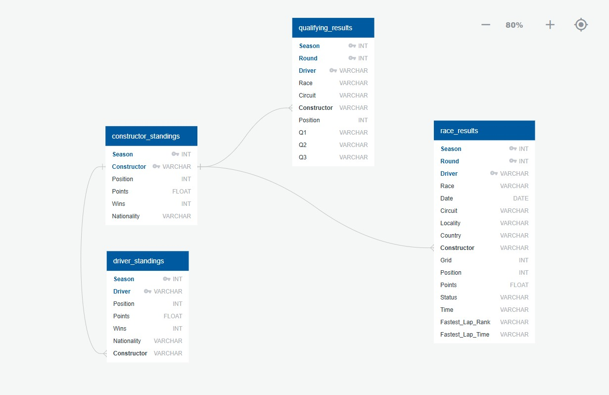

# 🏎️ Formula 1 Race Winner Prediction (2015–2025)

## 📡 Project Overview  
This project uses a neural network model to predict the winner of a Formula 1 race based on historical race data, retrieved from the [Jolpi.ca F1 API](https://jolpi.ca/) — a modern, developer-friendly interface for accessing Ergast data.

The workflow includes:  
- Dynamic data fetching from Jolpi’s API  
- Data cleaning, encoding, and scaling  
- Iterative deep learning model optimization using TensorFlow/Keras  
- Logging model performance across multiple architectures  
- Predicting future race winners (e.g., Round 1 of 2025)

---

## 📡 API Source: Jolpi.ca  
The Jolpi F1 API provides fast and clean access to race data including:
- Season  
- Round  
- Race results (Driver placement and names)

**API endpoint used**:

https://api.jolpi.ca/ergast/f1/{season}/results.json

---

Replace `{season}` with a year (e.g., 2024) to fetch the data for that season.

---

## 🧠 Model & Optimization  
The script tests **three different neural network configurations**, each with varying:
- Layer sizes  
- Dropout rates  
- Learning rates  
- Batch sizes  

Performance is logged and evaluated based on:
- **Test Accuracy**  
- **Test Loss**

### ✅ Best Model Example:
Architecture: [64, 128, 64]
Dropout: 0.3
Learning Rate: 0.001
Batch Size: 42
Test Accuracy: 100%
Test Loss: 0.655

All configurations are logged in:  
`model_optimization_log.csv`

---

## 🏁 Final Prediction  
The trained model is used to predict the winner for the **first race of the 2025 season**:

> 🏆 **Predicted Winner**: Piastri

---

## 📊 Tableau Dashboard

Explore visual insights from the same dataset used in the model training process via an interactive Tableau dashboard:

🔗 **[F1 Championship Insights 2015–2024 (Tableau Public)](https://public.tableau.com/app/profile/valeria.jimenez.paz/viz/Formula12015-2024/F1ChampionshipInsights20152024)**

This dashboard includes:
- 🏁 Pit Stop Duration Analysis (by circuit, driver, and time of day)  
- 🌍 Longest Race Countries  
- 🧠 Performance breakdown by driver and constructor  
- ⏱️ Strategic insights across seasons  

All data was sourced from **CSV exports** derived from the same API-based pipeline used in the Python model.  
It provides a visual storytelling layer to support and validate the machine learning predictions.

---

## 🗃️ SQL Data Model & Relational Schema

To simulate a production-ready data pipeline, we designed and implemented a normalized **PostgreSQL schema** using key Formula 1 datasets. The data was manually imported from cleaned CSVs and structured using relational best practices.

### 🧱 Tables Created

We created the following tables and ensured relational consistency:

- `constructor_standings`
- `driver_standings`
- `qualifying_results`
- `race_results`

Each table includes **primary keys** and is designed to support **relational joins** for cross-table analysis and insights.

📄 **SQL Script Used:**  
[`SQL Formula 1 analysis.sql`](./SQL/SQL%20Formula%201%20analysis.sql)  
This file contains all the `CREATE TABLE` statements with correct data types, composite primary keys, and consistent naming conventions aligned with the CSV structure.

---

### 🧩 Entity-Relationship Diagram (ERD)

The following ERD illustrates the structure and relationships between the four core tables:

- Relationships are defined using shared keys: `"Season"`, `"Round"`, `"Driver"`, and `"Constructor"`.
- Foreign key references align across tables and follow a star-schema logic centered on race-level data.

---

> 💡 While the machine learning model uses pre-cleaned CSVs, this SQL implementation reflects real-world ETL logic and prepares the dataset for future use with tools like **SQLAlchemy** or **Apache Spark**.
---

## 📁 Data Sources

Race data was exported from the [Jolpi.ca F1 API](https://jolpi.ca/) for the seasons 2015–2024.  
After exporting, we **cleaned the files by removing unused or irrelevant columns** (e.g. URLs, nationality details, redundant IDs) to streamline the analysis and focus on performance-related features.

### ✅ Cleaned CSV Files Used:
- `f1_circuits_2015_2024_cleaned.csv`  
- `f1_constructor_standings_2015_2024_cleaned.csv`  
- `f1_constructors_2015_2024_cleaned.csv`  
- `f1_driver_standings_2015_2024_cleaned.csv`  
- `f1_drivers_2015_2024_cleaned.csv`  
- `f1_pitstops_2015_2024_cleaned.csv`  
- `f1_qualifying_results_2015_2024_cleaned.csv`  
- `f1_race_results_2015_2024_cleaned.csv`  

These cleaned files were used to create the visual dashboards in Tableau and also informed the design of the predictive model in Python.  
They are connected using shared keys such as `raceId`, `driverId`, `constructorId`, and `circuitId` to support relational joins and cross-feature analysis.

---

## 📂 Project Structure

Project_4_-_F1/
├── 📤 Output/                      → Model outputs, prediction logs, or images  
├── 🧹 Resources/Cleaned/          → Cleaned data used in modeling and Tableau  
├── 🗃️ SQL/                        → SQL schema, ERD image, and table creation script  
│   ├── 📄 SQL Formula 1 analysis.sql      → SQL script with CREATE TABLE statements  
│   ├── 🖼️ QuickDBD_ERD.jpg               → Visual ERD showing table relationships  
│   └── 🖼️ ERD_Code.jpg                   → ERD diagram in code format (QuickDBD style)  
├── 📓 Final_Analysis_Formula_1_Race_Prediction.ipynb  
│                                   → Main notebook with full modeling pipeline  
└── 📄 README.md                   → Project overview, methods, and documentation

---

## 🚀 Future Roadmap
- Add race-specific features (qualifying, constructor, grid position)  
- Expand with full Jolpi API endpoints (e.g., `/pitstops`, `/qualifying`)  
- Include visual performance comparison (bar plots, heatmaps)  
- Try ensemble models (e.g., XGBoost) for benchmarking  
